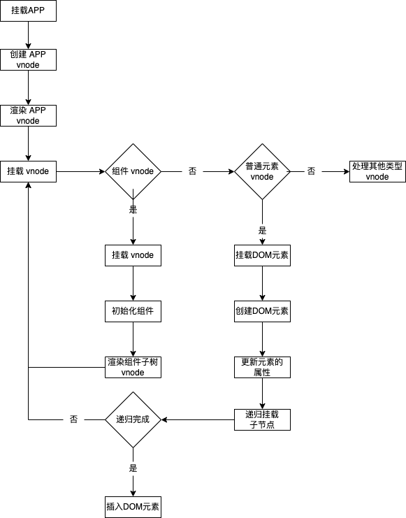
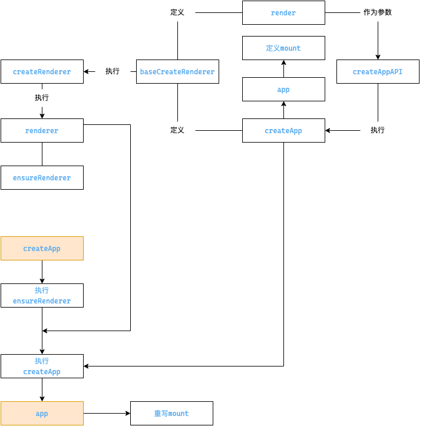

## 应用程序初始化






```js
import { createApp } from 'vue'
import App from './App'
const app = createApp(App)
app.mount('#app')
```

### createApp 创建app对象

```ts
// vue3-docs/packages/runtime-dom/src/index.ts
export const createApp = ((...args) => {
  // ensureRenderer() 创建渲染器对象 包含平台渲染核心逻辑的对象
  const app = ensureRenderer().createApp(...args)
  // web 平台 重写 mount
  const { mount } = app
  app.mount = function(){
    //...
  }
  return app
}) as CreateAppFunction<Element>

```
### ensureRenderer
```ts
// vue3-docs/packages/runtime-dom/src/index.ts
// 平台渲染相关的配置 属性更新 操作dom等
const rendererOptions = /*#__PURE__*/ extend({ patchProp }, nodeOps)
// 延时创建渲染器 当用户只以来响应式包的时候，可以通过 `tree-shaking` 移除核心渲染逻辑相关代码
function ensureRenderer() {
let renderer: Renderer<Element | ShadowRoot> | HydrationRenderer
let enabledHydration = false
  return (
    renderer ||
    (renderer = createRenderer<Node, Element | ShadowRoot>(rendererOptions))
  )
}
```
### createRenderer
```ts
// vue3-docs/packages/runtime-core/src/renderer.ts
export function createRenderer<
  HostNode = RendererNode,
  HostElement = RendererElement
>(options: RendererOptions<HostNode, HostElement>) {
  return baseCreateRenderer<HostNode, HostElement>(options)
}
```
### baseCreateRenderer
```ts
// vue3-docs/packages/runtime-core/src/renderer.ts
function baseCreateRenderer(
  options: RendererOptions,
  createHydrationFns?: typeof createHydrationFunctions
): any {
  const render: RootRenderFunction = (vnode, container, isSVG) => {
    // 组件渲染的核心逻辑
    if (vnode == null) {
      if (container._vnode) {
        // 销毁组件
        unmount(container._vnode, null, null, true)
      }
    } else {
      // 创建/更新组件
      patch(container._vnode || null, vnode, container, null, null, null, isSVG)
    }
    flushPreFlushCbs()
    flushPostFlushCbs()
    // 缓存 vnode 节点 表示已经渲染
    container._vnode = vnode
  }

  return {
    render,
    createApp: createAppAPI(render)
  }
}
```
### createAppAPI
```ts
// vue3-docs/packages/runtime-core/src/apiCreateApp.ts
export function createAppAPI<HostElement>(
  render: RootRenderFunction<HostElement>,
  hydrate?: RootHydrateFunction
): CreateAppFunction<HostElement> {
  // rootComponent 根组建对象 
  // rootProps 根属性
  return function createApp(rootComponent, rootProps = null) {
    const context = createAppContext()
    const app: App = (context.app = {
      mount(
        rootContainer: HostElement,
        isHydrate?: boolean,
        isSVG?: boolean
      ): any {
        // 创建根组件的 vnode
        const vnode = createVNode(
        rootComponent as ConcreteComponent,
        rootProps
        )
        // 利用传入的 render渲染器 渲染vnode
        render(vnode, rootContainer, isSVG)
        app._container = rootContainer
        return getExposeProxy(vnode.component!) || vnode.component!.proxy
      },
    })
    return app
  }
}

```


### mount 在web平台的重写

```ts
// vue3-docs/packages/runtime-dom/src/index.ts
const { mount } = app
// web 平台 重写 mount
app.mount = (containerOrSelector: Element | ShadowRoot | string): any => {
    // 标准化容器
    const container = normalizeContainer(containerOrSelector)
    if (!container) return
     const component = app._component
    // 如果组件对象没有定义 render/template 则取容器的 innerHTML作为组件的模版内容
    if (!isFunction(component) && !component.render && !component.template) {
      
    }
    // 挂载前 清空容器内容
    container.innerHTML = ''
    //  执行保存的 mount 方法 完成真正的挂载
    const proxy = mount(container, false, container instanceof SVGElement)
    if (container instanceof Element) {
      container.removeAttribute('v-cloak')
      container.setAttribute('data-v-app', '')
    }
    return proxy
}

```
